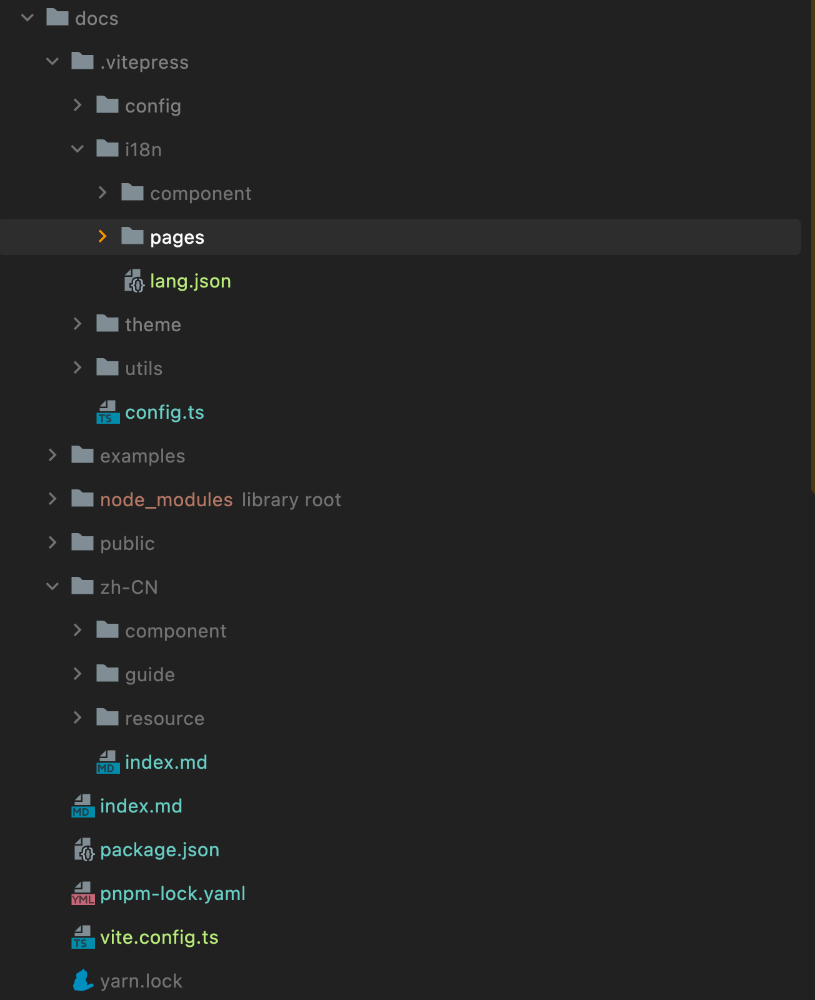

# Wei-Design

A Vue.js 3 UI library

---

<p>
  <a href="http://commitizen.github.io/cz-cli">
    
  </a>
  <br>
</p>

- 🔭 [Vite](https://vitejs.dev)
- 💪 [Vue3](https://vuejs.org)
- 🔥 TypeScript

UI原型：[element](https://element.eleme.cn/2.0/#/zh-CN/resource)

## 初始化

[create-vite](https://github.com/vitejs/vite/tree/main/packages/create-vite)

### 通过vite初始化

- npm

```bash
npm init vite@latest
```

- yarn

```bash
yarn create vite
```


选择`Vue`并选择使用`TypeScript`

### 指定模板初始化

```
yarn create vite vite-app-vue --template vue-tsc
```

## 基础配置

### 环境

`scss`预编译和`jsx`语法

- 安装

```shell
npm install sass @vitejs/plugin-vue-jsx --save-dev 
```

- 配置

在`vite.config.js`，添加

```javascript
import vueJsx from '@vitejs/plugin-vue-jsx'

export default defineConfig({
    plugins: [
        vue(),
        vueJsx(),
    ]
})
```

### 规范

- commit规范
- eslint

建议提前配置好，开发体验会更好

## 文档搭建

[vitepress](https://vitejs.cn/vitepress/)

### 快速搭建

- 1、根目录创建docs文件夹

```shell
mkdir docs && cd docs
```

- 2、初始化

```shell
yarn init
```

- 3、安装 `VitePress`

```shell
yarn add --dev vitepress
```

- 4、创建第一篇文档

```shell
echo '# Hello Vue3' > index.md
```

- 5、在`package.json`中添加脚本

直接使用.

```json
{
  "scripts": {
    "docs:dev": "vitepress dev .",
    "docs:build": "vitepress build .",
    "docs:serve": "vitepress serve ."
  }
}
```

完整版`package.json`如下：

```json
{
    "name": "@wei-design/docs",
    "private": true,
    "scripts": {
        "docs:dev": "vitepress dev .",
        "docs:build": "vitepress build .",
        "docs:serve": "vitepress serve ."
    },
    "devDependencies": {
        "vitepress": "^0.22.4"
    }
}
```

- 6、启动文档站点

```shell
yarn docs:dev
```

### 配置

#### 1、新增配置文件

```shell
mkdir .vuepress
touch config.js  
```

#### 2、添加sidebar和nav

- sidebar：左侧菜单

```javascript
const sidebar = {
    '/zh-CN/guide/': [
        {
            text: '基础',
            children: [
                { text: '设计', link: '/zh-CN/guide/design' },
                { text: '导航', link: '/zh-CN/guide/nav',},
                { text: '安装', link: '/zh-CN/guide/installation' },
                { text: '快速开始', link: '/zh-CN/guide/quickstart' },
            ],
        },
        {
            text: '进阶',
            children: [
                {
                    text: '国际化',
                    link: '/zh-CN/guide/i18n',
                },
                {
                    text: '主题',
                    link: '/zh-CN/guide/theming',
                },
                {
                    text: '暗黑模式',
                    link: '/zh-CN/guide/dark-mode',
                    promotion: '2.2.0',
                },
                {
                    text: '更新日志',
                    link: '/zh-CN/guide/changelog',
                },
            ],
        },
    ],
    '/zh-CN/component/': [
        {
            text: '基础组件',
            children: [{ link: '/zh-CN/component/button', text: 'Button' }],
        },
    ],
};
```

- nav：顶部导航

```javascript
const nav = [
    {
        "text": "指南",
        "link": "/zh-CN/guide/design",
        "activeMatch": "/guide/"
    },
    {
        "text": "组件",
        "link": "/zh-CN/component/button",
        "activeMatch": "/component/"
    },
    {
        "text": "资源",
        "link": "/zh-CN/resource/index",
        "activeMatch": "/resource/"
    }
]
```

基本效果


这里预留了多语言的口子，目录结构如下：




### 增加源码预览

### 自定义主题

## 打包

> 支持指定文件目录 -C

### 组件库

配置

```shell
build/lib.config.js
```

执行：

```shell
npm run lib:build
```

### 文档库

配置

```shell
build/doc.config.js
```

执行：

```shell
npm run -C docs build
```

## 问题及解决

TypeError: Invalid value used as weak map key

md中有无法解析的标签导致

