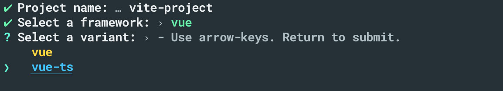
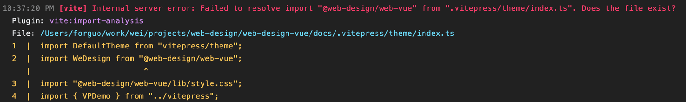
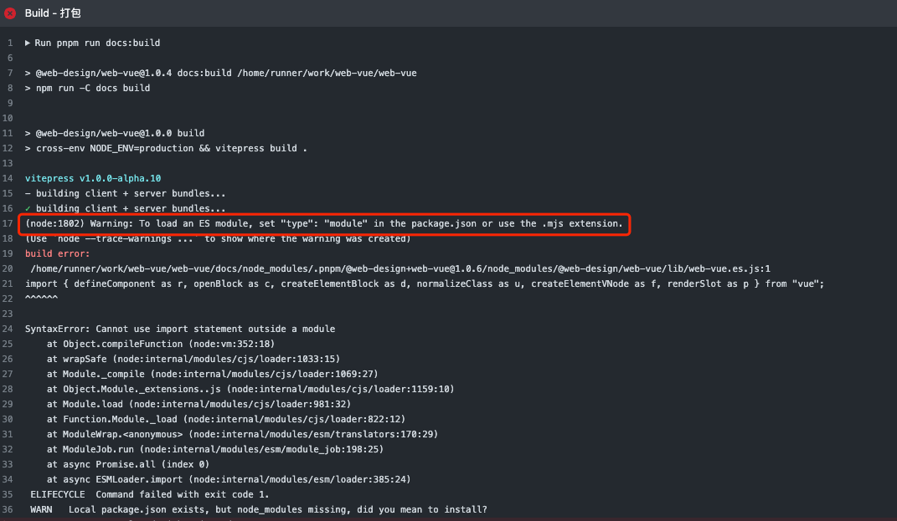

# @wei_design/web-vue

A Vue.js 3 UI library

[](http://commitizen.github.io/cz-cli)

[](https://www.npmjs.org/package/@wei_design/web-vue)

---

- 🔭 [Vite](https://vitejs.dev)
- 💪 [Vue3](https://vuejs.org)
- 🔥 TypeScript

参考[element](https://element-plus.org/)

## 将会学会

### 搭建
基于`vite`和`typescript`搭建`vue3`项目

### 开发
一个组件库的开发过程

### 发布
结合`github ci`来发布组件库到`npm`

## 环境

- node：>=16.0.0

## 目录结构

<details>
<summary>查看目录</summary>

```
├── config                              # 配置文件
├── cloud                               # 云函数存放
├── dist                                # 打包文件
├── node_modules                        # 依赖的模块包
├── package.json                        # 项目基本信息
├── src                                 # 项目的核心组件
│   ├── service                         # 资源文件（css、image、config）
│   ├── common                          # 资源文件（css、image、config）
│   ├── components                      # 公共组件
│   ├── store                           # 状态管理（redux）
|   ├── pages                           # 页面文件目录
|   |   ├── Index                       # index页面目录
|   |   |   ├── index.jsx               # index页面逻辑
|   |   |   └── index.scss              # index页面样式
|   |   |   └── index.config.js         # index页面配置（小程序page.json内容）
│   ├── util                            # 公共方法(util.js、globalData.js)
│   ├── app.jsx                         # 入口文件
│   ├── app.scss                        # 公共样式
│   ├── index.html                      # 主页模板
├── static                              # 静态资源(CDN)
├── README.md                           # 项目描述信息

```
</details>

## 初始化

[create-vite](https://github.com/vitejs/vite/tree/main/packages/create-vite)

### 通过vite初始化

- npm

```bash
npm init vite@latest
```

- yarn

```bash
yarn create vite
```



选择`Vue`并选择使用`TypeScript`

### 指定模板初始化

```
yarn create vite vite-app-vue --template vue-tsc
```

## 基础配置

### 包管理

添加`.npmrc`

```
shamefully-hoist=true
```

作用是将安装的依赖包的依赖包...做扁平化处理，都放在同一级

### 环境

`scss`预编译和`jsx`语法

- 安装

```sh
npm install sass @vitejs/plugin-vue-jsx --save-dev 
```

- 配置

在`vite.config.js`，添加

```javascript
import vueJsx from '@vitejs/plugin-vue-jsx'

export default defineConfig({
    plugins: [
        vue(),
        vueJsx(),
    ]
})
```

### 规范

建议提前配置好，开发体验会更好

- [commit规范](https://www.yuque.com/forguo/f2e/elkm1q)

- [eslint + prettier](https://juejin.cn/post/7011871773687808031)

## 文档搭建

[docs](./docs/Readme.md)

## 打包

> 支持指定文件目录 -C

### 组件库

配置

[vite库模式配置](https://cn.vitejs.dev/guide/build.html#library-mode)

```sh
build/lib.config.js
```

执行：

```sh
npm run lib:build
```

### 文档库

配置

```sh
build/doc.config.js
```

执行：

```sh
npm run -C docs build
```

## 发布

### package配置说明

wei_design【组织】，web-vue【包名】

```json
{
    "name": "@wei_design/web-vue"
}
```

### npm发布

peerDependencies作用

- 私有发布

npm publish 命令执行，默认是进行私有发布
scoped的包私有发布时需要收费

- 公共发布

```sh
npm publish --access public
```

npm publish 时提示需要升级TLS 1.2的解决方案

看看registry是否是https的，否则需要切换到https

```sh
npm config set registry https://registry.npmjs.org
```

副作用导致打包后的css不能引入

[sideEffects](https://juejin.cn/post/7096307096836112398)

## 问题及解决

- TypeError: Invalid value used as weak map key

**md中有无法解析的标签导致**

- 引入`lib/style.css`导致ModuleNotFound错误



去掉`package`当中这行代码

修改导出条件语法，新增`./lib/style.css`

```json
"exports": {
    ".": {
        "import": "./lib/web-vue.es.js",
        "require": "./lib/web-vue.umd.js"
    },
    "./lib/style.css": "./lib/style.css"
}
```

- vitepress打包报错

To load an ES module, set "type": "module" in the package.json or use the .mjs extension.



解决办法，替换如下

[库模式](https://cn.vitejs.dev/guide/build.html#library-mode)

vite.config

```js
build {
    lib: {
        entry: resolve(__dirname, './packages/index.ts'),
            name: 'WebVue',
            fileName: 'web-vue'
    },
}
```

package.json

```json
"main": "./lib/web-vue.umd.js",
"module": "./lib/web-vue.mjs",
"exports": {
    ".": {
        "import": "./lib/web-vue.mjs",
        "require": "./lib/web-vue.umd.js"
    },
    "./lib/style.css": "./lib/style.css"
},
```
